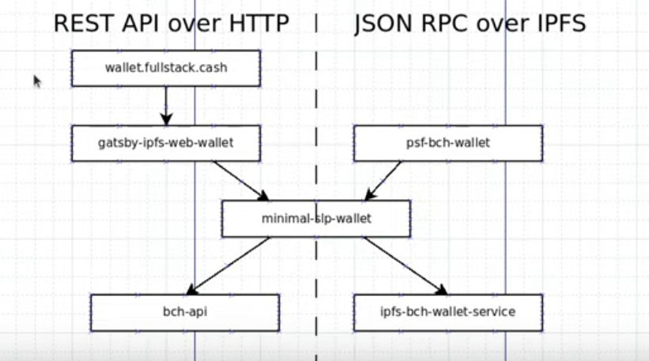

# Developer Documentation

The minimal-slp-wallet library is used to tie in the [psf-bch-wallet](https://github.com/Permissionless-Software-Foundation/psf-bch-wallet) command line wallet and the [gatsby-ipfs-web-wallet](https://github.com/Permissionless-Software-Foundation/gatsby-ipfs-web-wallet) web wallet. They both leverage minimal-slp-wallet as the 'wallet engine'.

This is highly complimentary, as psf-bch-wallet can be used for rapid prototyping and debugging. The web wallet is slower to develop on, but makes for a more accessible (non-developer) UI.

